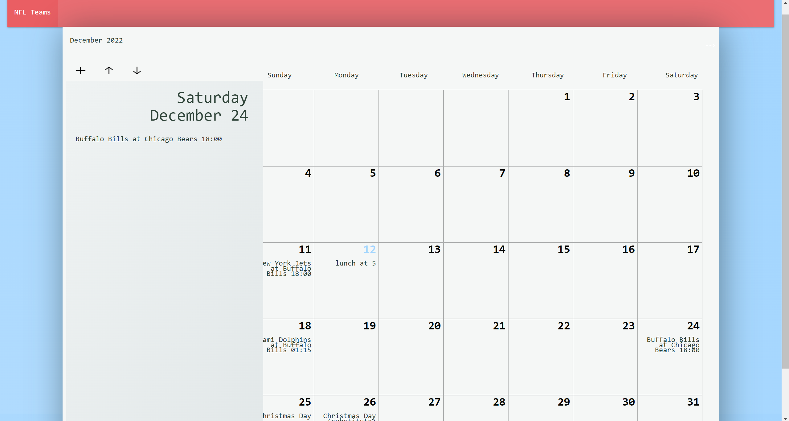

## Description
 [https://jennahopeclem.github.io/monthly-planner/]
 
 
- This webpage is designed to organize your upcoming events.
- The user can find upcoming holidays aswell as football games by team name .
- The user can enter there own event plans and save them to the calender.
- The calender self updates to highlight present day aswell as chnage dates and days to correspond with present month.

 

 
 
 
## Table of Contents
 
 
 
- [Description](#description)
- [Resources](#resources)
- [Usage](#usage)
- [Author](#author)
- [Features](#features)
 
 
 ## Resources
- #https://www.w3schools.com/howto/howto_js_dropdown.asp
- #https://calendarific.com/api-documentation
- #https://codepen.io/tomcwatts/pen/PmaWpZ
- #https://materializecss.com/
- #https://calendarific.com/api/v2/holidays?&api_key=0f6f3c056e70ebca75cebdcc5cbbadf546e7c0c1&country=US&year=2022
- #https://sports.core.api.espn.com/v2/sports/football/leagues/nfl/teams?limit=32
 
 
## Usage
- This website provides users with a real time calender.
- The calender will auto adjust its weekdays and numbers to the proper position based on the current month.
- When the page is loaded the user can immediately see the present date and time.
- The user will be displayed any holidays that fall within that month on its corresponding day to the calender.
- The user is presented with a drop down menu that features all NFL teams.
- When a specific NFL team is clicked , the calender will display all upcoming games tot the calander on the date they fall in with  the time and match-up.
- The user can click on the specific day they want to add an event to.
- After clicking there disiered day the user will be displayed  present current events saved and a text box to add events.
- This feild will appear on the left hand side of the calender.
- After the user has input there message by clicking the save button it will be stored onto there calender.

 
 
 
 
 
 
## Features
 - Self updating calender.
 - Present date highlighted text.
 - Text area to input messege/events and save button to store text entry
 - Drop down menu  that scrolls with all NFL teams upon click will display team selected upcoming events.
 - All holidays that are present in that month will be automatically inputed into the calender..
 
## Author
(email at : tranmichelle997@gmail.com)
(email at : azimeznail@gmail.com)
(email at : jennahopeclem@gmail.com)
(email at : connorbottone@gmail.com)
